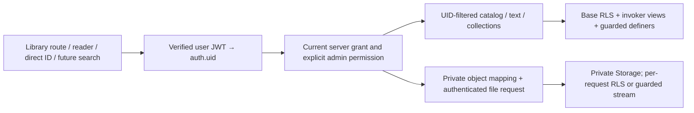

# Issue #123 — Ministers Library access audit and remediation plan

Baseline: current `main` `5d376214295491a0d78b2637477a5bbd58eb14e0`, after merged Safari Print work. Branch: `codex/issue-123-ministers-library-security`.

**Disposition:** repository audit completed; client cache defects reproduced with synthetic fixtures. Backend remediation is necessary, but live RLS, entitlement ledger, RPC/view definitions, Storage state and two deployed Edge functions are unavailable in this workspace. This PR supplies review-only SQL rehearsals, a metadata inventory query and a staged remediation/rollback plan. It does **not** assert that Production is secure or that the deployed unauthorized-access defect has been fixed. No Production service was queried or mutated. No active runtime or existing migration is changed.

## Phase 1: access architecture and evidence

| Path / component | Repository evidence | Authorization significance |
| --- | --- | --- |
| Entry / route | `js/app.js:1282`, `:1454`, `:2212`, `:2629`; book hub → Library; `params.tab` / `nh7_library_tab` selects `public` or `ministers`. | Both tabs exist. UI calls `nh7RequireSchoolAccessV223`; approved School status is not a minister grant. Route/navigation hiding is not authorization. |
| Catalog | `js/app.js:2146` → `cloudRpc('nh7_library_catalog_v396', {})`; `js/nh7-library-collections-v322.js:23` and `js/nh7-book-reader-v283.js:40` call the same RPC. | Server must filter items **and collection metadata** per authenticated UID before serialization. Definition is absent from checked-in SQL. |
| Direct REST / old clients | `js/nh7-access-bootstrap-v230.js:70` intercepts GETs for `nh7_library_items_v222` / `_v224` and routes them to `nh7-content-access`. Legacy `js/nh7-library-text-reader-v250.js:17` uses `_v224` but is not loaded by current `index.html`. | A browser fetch wrapper is bypassable by curl/direct REST and does not intercept catalog/reader RPCs. Both views/base table need independent server authorization. |
| PDF / DOCX | `js/app.js:2185` → `invokeEdgeFunction('nh7-library-access', {item_id,code,device_id,user_email})`, then fetches `signed_url`, creates Blob or DOCX viewer, exposes external URL. | Client-provided email/device/code must not authorize. Verify JWT then `auth.uid` / entitlement and immutable item→object mapping **before** privileged signing/streaming. Edge implementation is absent. |
| Active text reader | `index.html:172` loads `js/nh7-book-reader-v283.js`; `:92` → `nh7_library_reader_access_v250`; `:149` checks returned `allowed`; `:268` exposes `window.NH7_OPEN_BOOK`. | Calling `NH7_OPEN_BOOK(id)` is a direct entry path. RPC must gate text/pages before return. UI checks and catalog membership alone do not protect direct RPC calls. Reader keeps authorized text in an open modal until closed; grant revocation is not polled there. |
| Collections | `js/nh7-library-collections-v322.js:20–35` caches `{collections,items}` per email hash; audience filtering is local. | Backend must not reveal unauthorized collection title/description/count/IDs. The cache is not a grant or revocation mechanism. |
| Search | `index.html:158–159`, `js/nh7-finalqa-v558.js:138–199`, `js/nh7-global-search-direct-v562.js:130–140`. | Current exact Global Search queries Bible text, audio cache, saved references and local notes, **not** a Library index. No direct restricted-catalog provider found; actual module simulation with a synthetic cached Library row yields zero results in FA/EN/HR/FA. Copied excerpts in personal notes are already user-held content, and local notes are not minister-authority checks; do not delete notes to implement revocation. Any future Library provider must use the same UID-filtered server query, including snippets/counts. |
| Deep links / direct IDs | `js/app.js` navigation/hash route and `library(params)`; `[data-library-open]` finds a catalog ID; reader exposes `NH7_OPEN_BOOK`; raw reader RPC/item ID and Storage URL can be called independently. | Changing `tab`, hashes, DOM buttons or item IDs cannot grant server authority. A direct reader request must return denied/no payload even if catalog was previously cached. |
| Status / protected catalog | `js/nh7-access-bootstrap-v230.js:21–66`, `:81–101`: `nh7-content-access` actions `status`/`catalog`, 5-minute cached approval, stale/offline fallbacks. | School approval is broad content status; it must not replace per-item minister entitlement. This wrapper explicitly serves stored catalogs after errors, including permission denial. Its cached UI status can survive explicit logout when offline. |
| App catalog cache | `js/app.js:2141–2177`: `nh7_library_catalog_cache_v1`, shared session key, 10-minute initial TTL, unbounded error fallback and in-memory reuse. | Cache is not keyed by `auth.uid` or grant version; stale data can survive denial/account changes. `logoutAccount`, `js/app.js:2393`, does not clear this catalog or its in-memory copy. |
| Offline JSON | `index.html:141` loads `js/nh7-offline-data-v422.js`, not legacy `_v329`; `:40–51` respects remote `no-store` and passes 4xx rather than hiding them. | This newer generic layer has a useful 4xx safeguard, but inner Library/access/collection fallback layers still restore old data. Do not assume the generic fix closes every cache path. |
| Worker / downloaded bytes | `service-worker.js` imports `sw-offline-v329.js`; `:40–60` normalizes `/sign`, `/authenticated`, `/public` URLs into one object identity and serves stored protected media **before** network/auth. `js/nh7-offline-persistence-v323.js:4–10`, `:17–19`, `:41–43`: global `nh7-media-v2-protected`, IndexedDB `nh7-offline-media-v4/media`, native `offline_media_v4`, keys without UID/entitlement/expiry. | Seeded Library bytes are returned with no current-user check even for an expired signed token. Current Library cards do not expose a generic offline-download button; persistent Library-byte exposure is conditional on prior/legacy caching or invoking the shared download API, not proof all current Library files are automatically cached. Preserve unrelated audio/download behavior. |
| Native/public download page | `app/download-worker-v1.js` handles App Store / Play Store landing page only. | Not a Ministers Library authorization/download endpoint. |
| Admin direct grant/revoke | `admin.html:706` loads `js/nh7-admin-library-access-v396.js`; `:32` → `nh7_admin_content_access_dashboard_v395` + REST `nh7_library_collections_v322`; `:35` → `nh7_admin_content_access_grant_v251`; `:36` → `nh7_admin_content_access_revoke_v251`. UI scopes `library_all`, `library_collection`, `library_item`; `p_user_id`, `p_scope`, `p_resource_id`, `p_expires_at`, `p_note`; revoke uses `p_id`. | Target user UUID is appropriate **only after** server verifies the actor's management permission via `auth.uid`. UUID-format checks / showing a tab cannot authorize grant/revoke. Ledger table, write policies, actor checks and revoke implementation are not in repo. |
| Legacy code redemption | `minister-library-code.html` signs in and calls `nh7_library_claim_code_redeem_v433(p_code)` with user JWT. Legacy reader caches `nh7_minister_library_code`; current reader passes empty code. | Redemption must bind target account to JWT UID, validate code state/expiry and consume atomically. Do not infer that a cached code or matching supplied email is an entitlement. Definition absent. |
| Library editing / Storage | Admin collection/reader scripts call `nh7_admin_library_save_item_v224`, `nh7_admin_library_collections_dashboard_v322`, `nh7_admin_library_collection_save_v322`, `_delete_v322`. `js/admin-v2.3.9-library-batch-v281.js:22` reads authenticated `nh7-library/<storage_path>`. | Preserve editing APIs and existing grants. Inventory column-level ACLs and INSERT/UPDATE/DELETE policies: changing audience or grant rows must not be possible for ordinary users. No changes to those APIs are made here. |

### SQL objects and policy coverage

Confirmed definitions:

- `supabase/migrations/20261003172711_optimize_admin_library_dashboard_queries_v1.sql`: `public.nh7_admin_library_dashboard_v222()` / `_v224()` are `SECURITY DEFINER`, `search_path='public'`, read `nh7_library_items`, `nh7_library_access_codes`, `nh7_library_access_log`, guarded by `nh7_is_admin()`. The guard is `IF NOT ...`, so inspect whether its helper is guaranteed non-null; a null helper would not raise. Helper body/ACL is missing. This file does not re-establish execute ACLs.
- `supabase/migrations/20260825094000_admin_books_review_preview_v362.sql`: `nh7_admin_books_review_v362(uuid)` is definer; uses `coalesce(nh7_admin_is_admin(),false)`, revokes PUBLIC execution, grants authenticated, and can return `reader_text` only after its guard. Referenced helper definition is missing. Restricted titles/content are not copied into this audit.
- `supabase_v490_library_reading_progress.sql`: `nh7_library_reading_progress_v490`, own-user policies `nh7_library_reading_select_own_v490`, `_insert_own_v490`, `_update_own_v490`; `nh7_library_reading_record_v490` and `nh7_admin_library_reading_v490`. The latter joins item metadata under a coalesced admin guard. Reading telemetry is not an entitlement ledger. These student/report paths stay unchanged.
- `supabase/migrations/20261003171549_optimize_admin_engagement_analytics_v223.sql`: Admin analytics reads Library access logs/items. This is another privileged metadata path whose guard/ACL must be included in live validation.
- `supabase/migrations/20260821174931_admin_rbac_recovery_v350.sql:109–165`: `private.nh7_admin_is_owner_v350` and `private.nh7_admin_has_permission_v350` tie owner/delegate state, confirmed/unbanned auth account and permissions to `auth.uid`, using an empty search path. Do not substitute client roles. A Library-specific permission key was not found in this checked-in permission catalog; adapter design must verify deployed permissions instead of inventing an existing grant.

Not defined in repository: base Library table creation/RLS/ACL; `nh7_library_items_v222` / `_v224` view ownership/invoker flags; `nh7_library_collections_v322` definition/policies; grant ledger; catalog v396; reader-access v250; dashboard v395; grant/revoke v251; claim-code v433; `nh7-library-access` and `nh7-content-access` deployed Edge source. Only four other Edge function sources exist locally. No `nh7-library` bucket privacy or object-policy definition was found. The older `supabase_v1_7_0_dynamic_platform.sql` **church-audio** public policies do not establish Library bucket state; do not change audio policy based on them.

`supabase/review/issue123/00_read_only_inventory.sql` collects relation RLS/force/owner/ACL, columns, all relevant policy names/expressions, views, function identities/ACL/search paths/definer flags/hashes/dependencies and bucket privacy. It does not read books, grant holders, text or object paths. Policy definitions can identify users: review results privately and publish only sanitized findings. A `mentions_uid` flag is triage, not proof of secure logic; obtain full deployed function/Edge bodies privately for actual review. No live inventory was run in this session.

## Findings / root causes

| ID | Severity / certainty | Finding and result |
| --- | --- | --- |
| ML-01 | High, reproduced | Shared/unversioned catalog and stale fallbacks bypass fresh entitlement denial for metadata. Synthetic prior minister row survives forced RPC denial and expired TTL. Collection/access caches similarly restore snapshots. Source verification and actual code probes. |
| ML-02 | High, reproduced conditionally | If Library bytes were persisted, worker identity ignores account and signed-token expiry; actual worker serves a synthetic seeded Blob to anonymous/normal/revoked identities without network. Current active UI auto-caching of every file is **not** asserted. |
| ML-03 | Critical verification gap | Server entitlements, reader/catalog filtering, grant ownership and Storage privacy cannot be established from supplied source. Treat reported unauthorized access as a real defect; do not certify zero restricted rows/files until live-schema and real-JWT matrix tests pass. |
| ML-04 | High architectural risk | Owning views/unguarded definers/service-role signing bypass base RLS. Local PostgreSQL demonstrates an owning view/insecure definer still returns restricted rows after candidate table fences; invoker view fixes the view path. This is a synthetic bypass example, not proof those exact unsafe deployed definitions exist. |
| ML-05 | High / token-lifetime dependent | Restricted signed URLs are bearer capabilities, not bound to the recipient's current `auth.uid`. A URL can be shared and stay usable after revoke until expiry, and cached bytes outlive expiry. UI's “10 minutes” label is not proof of deployed signer TTL. Strict anonymous-zero requires authenticated per-request delivery rather than issuing new restricted bearer URLs. |
| ML-06 | Medium, source-confirmed | Offline cached UI approval can remain true after explicit logout; no fresh minister check for an already-open reader/Blob viewer. UI state is not a trusted authorization source and cannot retract content already delivered. |
| ML-07 | Compatibility/security constraint | Already downloaded/exported files or user-copied notes cannot be remotely made unreadable. Quarantine controlled legacy Library caches in future clients and require online revalidation for restricted content. Do not delete unrelated files/notes/student data or claim revocation erases external copies. |

## Target authorization architecture

Default-deny. Actor is `auth.uid()` obtained from a verified JWT, never email/device/role metadata/request target parameters. Preserve existing School approval semantics separately; School approval does not create a minister grant. At each restricted read check active/published item, active unexpired `library_all` / matching collection / matching item grant, or explicit server-managed Library admin/owner permission. A revoked grant or disabled admin no longer authorizes the next request, even with a still-valid JWT. Unknown resource/scope/audience, missing mapping and unavailable authority deny.

Catalog/list/detail/reader/search and collection metadata must use one predicate **before** returning rows/text/counts/paths. RLS must cover the base relation and any content/collection/grant tables; views must be security invoker (PG15+) or explicitly guarded. Each definer and service-role Edge operation independently checks actor UID and the exact resource; base RLS cannot do that for them. Pin search path, fully qualify objects, use a trusted non-login owner and explicit least-privilege execute grants. Grant/revoke/code redemption actor checks are server-side; client `p_user_id` is a management target, not actor identity. Preserve legacy endpoint signatures where possible and ignore legacy `p_user_email` for authorization.

For restricted file requests use a verified user JWT plus private Storage RLS, or a guarded same-origin/Edge stream that checks each request/Range and returns bytes with `private, no-store`. Never accept arbitrary client object paths for service-role reads. The stream derives the object from an approved item mapping, checks all references when an object serves multiple items, and never returns an underlying privileged URL. Reject anonymous requests before lookup/stream. Do not issue new restricted signed bearer URLs if strict anonymous-zero is required.

**Legacy Storage blocker:** a new private copy does not secure an old public original. Inventory actual bucket public flags, mapping and active signed TTLs. If current `nh7-library` is private, prepare object-level restrictions for old mapped restricted objects too. If it is public/mixed, non-deleting containment requires an approved privacy/compatibility transition for that original bucket and public-item clients; copying files alone is insufficient. Do not make a mixed bucket private blindly or rotate project-wide signing/auth secrets. Existing signed capabilities need a verified expiry/drain/containment plan. No bucket/file move, deletion or metadata mutation is made in this PR.

Controlled cache policy: restricted Library metadata/bytes are online-only, per-UID/per-entitlement-version, never restored on 401/403/offline and rechecked before opening. Logout/account switch/revoke hides restricted modals and quarantines legacy Library cache identities; re-entry requires fresh server approval. Do not call broad `CLEAR_MEDIA` (it affects audio), delete saved verses/notes or change generic audio playback/download machinery. Previously exported files remain beyond technical revocation. If offline grants are ever desired, a separate approved lease model changes the strict revoke guarantee; it is not proposed here.

## Phase 2: safe branch artifacts and rollout gates

1. **Inventory and compare deployed state privately.** Collect complete function/view/policy/Edge definitions, ACLs and grant/object mappings; confirm published/active/audience semantics, confirmed/unbanned UID checks, admin permission catalog, function owners, RLS force flags and public/signed Storage behavior. Unknowns block deployment.
2. **Staging-only adapter review.** Existing ledger remains source of truth. `01_authorization_rehearsal.sql` has empty grant/admin/object adapter views in a new isolated schema; they deliberately deny until replaced by verified mappings. It assumes known item fields only as a rehearsal. It preserves existing grants and does not edit legacy endpoints, School or student tables.
3. **Proposed database fences.** Rehearsal defines UID-scoped boolean helpers, restrictive SELECT fences on base Library items, narrow permissive SELECT for allowed restricted items, new restricted-only catalog/reader RPCs and private-object SELECT fences/allow policy for a **provisional new private bucket**. Other buckets/public item behavior is preserved in the local fixture. It does not create/move a bucket or secure the existing `nh7-library` namespace. Empty adapters, missing collection fences/legacy endpoint rewrites/Storage state mean this is **not deployment-ready migration SQL**.
4. **Complete an approved follow-up implementation.** Harden every existing view/RPC/definer and grant/code writer; validate public-item/School compatibility; add authenticated restricted file delivery and legacy bucket containment. Keep old client signatures where safe; insecure old clients may need an explicit upgrade denial rather than continued data disclosure. Unknown collection/view schema is not replaced with guessed SQL.
5. **Library-only client cache integration.** After backend contract verification, stage per-UID fresh authorization and non-serving of legacy restricted caches. Current shared files, audio engine, offline audio/native downloads and student notes remain unchanged in this audit PR. No UI filter is represented as a security fix.
6. **Real Supabase staging role/API matrix, then explicit Production approval.** No automatic migration, deploy or merge. New review scripts have no Production credentials/connectivity. SQL sits in `supabase/review/issue123`, outside `supabase/migrations`, is gated to `local-fixture`, and always ends in `ROLLBACK`.

## Rollback plan

Current review has nothing deployed to undo. SQL rehearsals rollback their entire transaction and local tests verify that the candidate RPC disappears afterward. Before any approved rollout, securely capture exact existing function/view/policy/ACL/owner/Storage definitions and sanitize an evidence record; preserve all grants, object bytes and public/student behavior. Roll out backend fences, file gateway and clients in separately reviewed stages with a restricted-feature pause as the safe fallback.

If adapters/client compatibility fail, pause restricted access and fix forward while retaining deny; do not resurrect an insecure definer/public URL just to restore UI. `02_rollback_rehearsal.sql` illustrates neutralizing only the six new policies with `ALTER POLICY` in a gated rollback-only local transaction, without dropping policies/functions/tables or deleting files/grants. Tests explicitly show that neutralizing fences can restore the synthetic baseline exposure; this is **not a safe default Production recovery**. It requires separate security approval and exact baseline comparison. New RPCs remain guarded, existing signatures/ledger are untouched. Storage buckets must never be made public as rollback, and exported bytes cannot be recalled. A Production rollback script cannot be finalized until the real baseline and approved rollout design exist.

## Validation matrix and evidence

All examples use invented UUIDs, invalid-domain synthetic identities and synthetic content markers. No restricted books, real grants, object paths, users, JWTs or Production responses appear in fixtures/logs. Structured evidence in `ISSUE_123_TEST_EVIDENCE.json` separates baseline defects, SQL candidate behavior and untested live behavior.

| Case | Local evidence | Remaining real-system check |
| --- | --- | --- |
| Anonymous | Candidate RLS: zero restricted rows/objects; restricted RPC execute denied. Seeded baseline offline Blob remains exposed. | Real anon JWT/API, REST views, Edge, public/signed/authenticated original URLs and file bytes must disclose zero. |
| Normal authenticated | Zero candidate restricted rows/objects/catalog/reader payload; spoofed email/role/direct item ID denied. | Real approved School user without ministry grant, all current APIs and collection metadata. |
| Authorized minister | Item=1 row/1 object, collection=2/2, all=3/2; ungranted item denied. | Actual ledger scope mapping, expiry and active/publication semantics, file HTTP/Range. |
| Revoked / expired | Zero after revoke/expiry; same UID/JWT context and fresh login denied immediately. | Real grant/revoke RPC transaction, signer TTL/drain, open viewer and legacy client behavior. |
| Admin / owner | Explicit server adapter allows; inactive admin denies; direct grant data access/write denied for ordinary actor. | Real owner/delegate permission helpers, disabled/banned users and grant/revoke actor checks. |
| Direct URL / deep link | Exact item RPC ID scoped in SQL; catalog cache and offline object identity bypass reproduced. | Actual app deep link / direct REST view / original Storage file and unauthenticated sign/public routes. |
| Global Search | Current exact-result layer has no Library catalog provider; existing Bible/audio/note sources confirmed. | Browser search with only synthetic restricted sentinel; any future server search/snippets/counts must use predicate. |
| Cached / offline / downloaded | Actual JS cache fallback and worker seeded-Blob behavior reproduced; candidate does not repair them. | Library-only controlled-cache quarantine; external saved copies explicitly not retractable. |
| Fresh login after grant/revoke | Actual local PostgreSQL predicate changes immediately without changing UID claims. | Real auth users/tokens, browser logout/account switch and edge caching. |
| FA / EN / HR | Synthetic SQL item has all three fields; existing localized Library/reader/access controls and RTL source mapped; existing i18n suite run separately. | Staging browser denied/allowed UI in all three languages; no active UI edits here. |

Commands: `node scripts/verify-ministers-library-audit-v123.mjs` runs dependency-free actual-source probes. `NH7_PGLITE_PACKAGE=<external-package-path> node scripts/verify-ministers-library-sql-v123.cjs` runs real in-memory PostgreSQL via pinned PGlite 0.3.14 (temporary install outside repository, no runtime dependency). It tests 19 cases, including RLS role switching, private adapter ACLs, direct RPCs, server grants/admin state, a synthetic definer/owning-view bypass and transactional rollback. It is not a JavaScript-only model of PostgreSQL policies. The local `auth.uid` function reads a synthetic request claim; JWT verification and real Edge/Storage HTTP delivery require staging tests. It is not a live Supabase/API test.

## Production approval still required

Read-only live metadata/private body review with authorized access; staging credentials/test identities and non-sensitive canary objects; final verified adapters and legacy endpoint/view/collection/grant-policy migrations; private Storage containment/compatibility and authenticated delivery; signed-link lifetime/drain decision; Library-only controlled cache/old-client upgrade plan; final rollback definitions; deployment/merge/Production migration authorization. None is performed or implied by this PR. The reported access defect remains open operationally until these steps and the zero-disclosure real-device/API matrix pass.

## Changed files and regression checks

Only these eight new review artifacts are added; all existing tracked files remain unchanged.

| File | Purpose |
| --- | --- |
| `docs/audit/ISSUE_123_MINISTERS_LIBRARY_SECURITY.md` | Architecture map, evidence, findings, remediation, compatibility, rollback, matrix and approval gates. |
| `docs/audit/ISSUE_123_TEST_EVIDENCE.json` | Sanitized synthetic probe/SQL results; no live-system certification. |
| `supabase/review/issue123/README.md` | Review-only handling and reproducible local PostgreSQL test instructions. |
| `supabase/review/issue123/00_read_only_inventory.sql` | Private read-only metadata collection for missing live definitions. |
| `supabase/review/issue123/01_authorization_rehearsal.sql` | Gated rollback-only UID/RLS/object/RPC draft with deliberately empty adapters. |
| `supabase/review/issue123/02_rollback_rehearsal.sql` | Gated rollback-only policy-neutralization illustration and security cautions. |
| `scripts/verify-ministers-library-audit-v123.mjs` | Actual-source cache/worker/search probes and complete unchanged-runtime scope check. |
| `scripts/verify-ministers-library-sql-v123.cjs` | Real local PostgreSQL role/policy/function/rollback tests using synthetic fixtures. |

Passing: all four current app/Admin validation steps, Next Native Optimization Guard, existing School report contracts, Print/PDF/CSV browser suite in #121 mode, School report browser suite, 11-route i18n/browser/protected-feature regressions, new audit/SQL suites, syntax/JSON and diff whitespace. Existing tests use isolated local services and mocked remote requests; no Production writes occur.

All existing read-only workflow checks were run: 15 passed; six historical checks failed identically on untouched current-main archive (v447/v451 old Admin wiring/releases, audio-23945 old loader/version twice, Wave 1A old wiring, Wave 1B old classic-audio loader). Old auth v348 and RBAC v350 scripts likewise fail on both trees because they require release `2.3.9.40`. Unrelated historical patch/commit, deployment and live Production Edge CORS/auth probe were excluded. No protected feature or old release metadata was changed to appease historical assertions.
